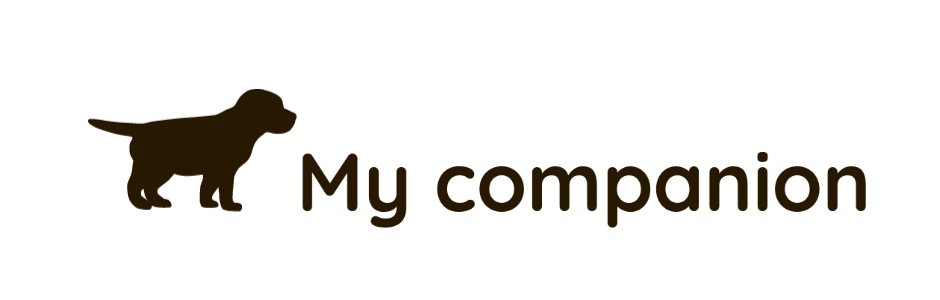

# My companion

## Codeworks - Solo project

<p align="center">
  
</p>

This mobile oriented website helps keep track of your Dogs data, vet appointments & medication.
It was created during Codeworks bootcamp, in a period of a week, in order to practice and test coding skills.

# Screenshots

<p align="center">
<a href="images/promo shots.png"></a>
</p>

# Instructions

- Clone this repository
- Navigate to `./client` and run `npm i`
- Navigate to `./server` and run `npm i`
- Create a `.env` in `./client` with the following structure and add your custom values on APP ID, JS KEY and MONGODB STRING:

```js
REACT_APP_APP_ID=SOME_VALUE
DATABASE_URI=MONGODB_CONNECTION_STRING
REACT_APP_JAVASCRIPT_KEY=SOME_VALUE
REACT_APP_SERVER_URL=http://localhost:1337/database

#IF YOU WANT TO USE EMAIL NOTIFICATIONS
EMAIL=GMAIL_TO_USE
EMAIL_PASSWORD=GMAIL_PASSWORD
```

- Create a copy of the `.env` in `./client` and move it to `./server`
- In `./server` start the backend with `node index.js`
- In `./client` start the website with `npm start`

## Demo video:

[Video](https://youtu.be/nAHyZd0Ej88)
